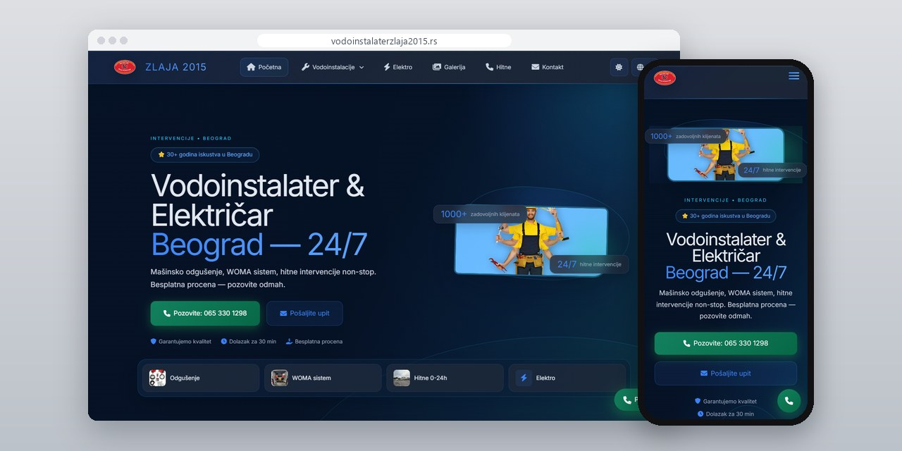
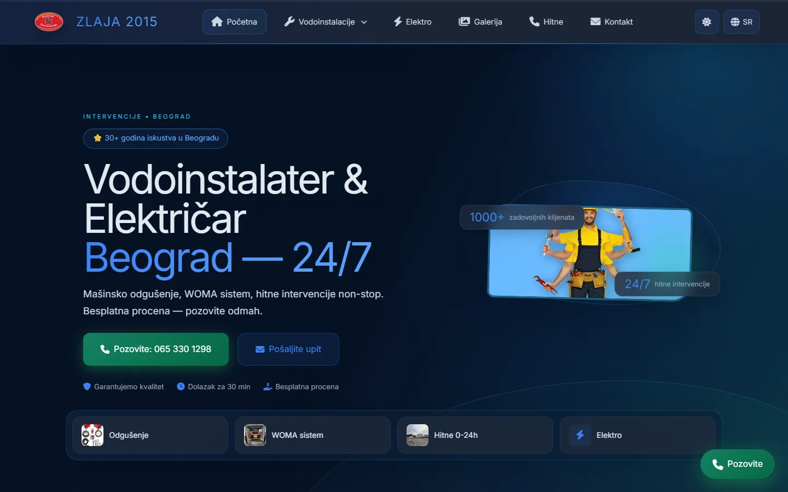
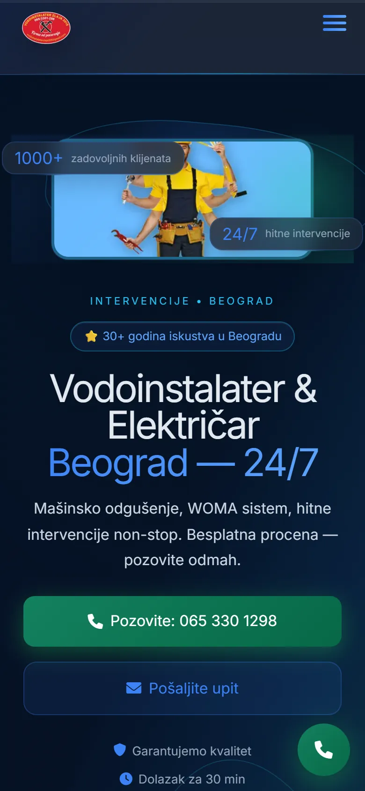
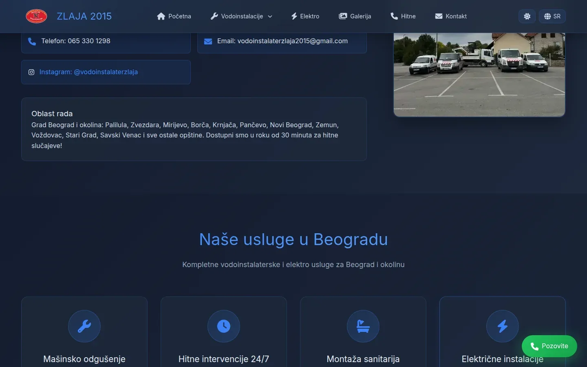
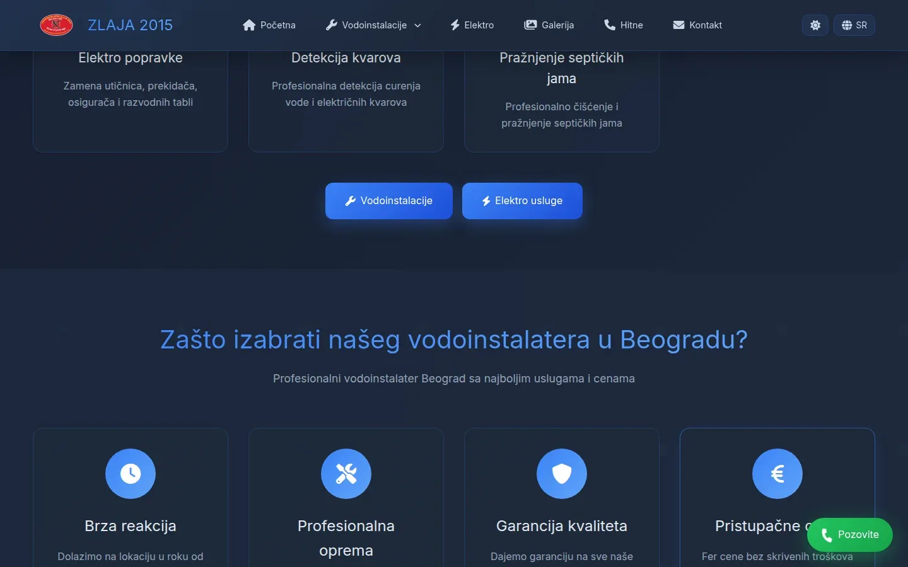

# Zlaja 2015

Site for a Belgrade plumber and electrician built around a single action, the phone call, plus a work-order PWA that runs offline.

**[vodoinstalaterzlaja2015.rs](https://vodoinstalaterzlaja2015.rs/)** · [Case study (in Serbian)](https://svilenkovic.com/radovi/vodoinstalater-zlaja) · [App page](https://svilenkovic.com/en/aplikacija-vodoinstalater) · [Srpski](README.sr.md)

> [!NOTE]
> Client project. The source code belongs to the client and stays in a private repository. This page describes what I built and how.

<table>
  <tr><td><b>Client</b></td><td>Zlaja 2015</td></tr>
  <tr><td><b>Industry</b></td><td>Plumbing and electrical work with 24/7 emergency call-outs</td></tr>
  <tr><td><b>Location</b></td><td>Belgrade, Serbia</td></tr>
  <tr><td><b>Type</b></td><td>Multi-page website with a work-order PWA</td></tr>
  <tr><td><b>My role</b></td><td>Design, development, SEO, hosting and maintenance</td></tr>
  <tr><td><b>Stack</b></td><td>PHP 8.3, nginx FastCGI cache, MariaDB, PWA, vanilla CSS/JS</td></tr>
</table>

## About the project

Zlaja 2015 does plumbing and electrical work across Belgrade, day and night: machine drain cleaning, high-pressure WOMA jetting, septic tanks, water heaters and complete wiring. A visitor usually has water on the floor and wants a number that works now, so every page opens with a tap-to-call number. Each service and each municipality also has its own page, because that is how people search.

The site speaks Serbian and English without a second copy of the pages. Text is written in pairs on elements marked with data-translate, and before the page is sent, PHP's output buffer keeps the half that matches the language cookie. The catch was the nginx FastCGI cache, which answers without running PHP, so the first visitor would have picked the language for everyone for the next ten minutes. The language cookie is now part of the cache key.

## What I built

- A work-order PWA that runs offline, with an unpaid status next to done, priorities up to urgent and photos from the job
- Clients as people or companies, costs by category tied to a job, and reports by month, year and worker; a worker sees only their own open jobs
- Google Tag Manager held back until the first scroll, tap or click, or four seconds, which brought most of the speed gain
- The font subset with č, š, ž, ć and đ preloaded on every page, after first-time visitors saw those letters fall back to a system font
- A lightbox without an empty img src, which had made the browser fetch the whole page a second time
- Server fixes: a www redirect that keeps the path, security.txt reachable past the hidden-files rule, and IPv6 listening

## Results

| | Performance | Accessibility | Best practices | SEO |
| :-- | :-: | :-: | :-: | :-: |
| Mobile | 99 | 100 | 100 | 100 |
| Desktop | 95 | 100 | 100 | 100 |

PageSpeed Insights, lab test of the live site, September 2026. Security headers: 6 of 6. HTML validator: no errors. axe accessibility check: no violations. Structured data: `BreadcrumbList`, `FAQPage`, `LocalBusiness`, `Plumber`.

## Screenshots

<table>
  <tr>
    <td width="68%" valign="top"></td>
    <td width="32%" valign="top"></td>
  </tr>
</table>

Services in Belgrade: drain unblocking, emergency call-outs, bathroom fixtures and electrical work

Electrical repairs and fault detection, then reasons to choose this handyman

---

Built by [D. Svilenković](https://svilenkovic.com).
